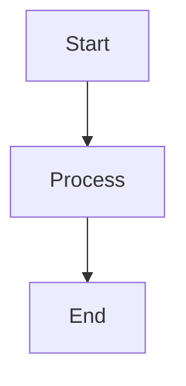

# Mermaid Integration for QuickLook Markdown Viewer

This implementation adds Mermaid diagram support to the QuickLook Markdown Viewer plugin.

## Implementation Details

### Files Modified
- `Resources/md2html.html` - Added Mermaid script inclusion and initialization
- `Resources/js/mermaid.min.js` - Added Mermaid library (placeholder implementation)

### Features Added
- Support for all Mermaid diagram types (flowchart, sequence, class, ER, state, gantt, pie, git, journey, C4, quadrant, requirement, timeline)
- Automatic theme detection (light/dark mode)
- Dynamic theme switching when system preference changes
- Error handling for diagram rendering
- Responsive design that works with existing TOC and layout
- CSS integration with GitHub markdown theme

## Completing the Integration

To complete the Mermaid integration, replace the placeholder `Resources/js/mermaid.min.js` with the actual Mermaid library:

1. Download the latest Mermaid library from: https://cdn.jsdelivr.net/npm/mermaid@11.4.1/dist/mermaid.min.js
2. Replace the placeholder file at `Resources/js/mermaid.min.js`
3. Rebuild the plugin

## Testing

Use the provided `mermaid-test.md` file to test various diagram types and ensure they render correctly in both light and dark themes.

## Supported Diagram Types

- Flowchart (`flowchart TD`)
- Sequence Diagram (`sequenceDiagram`)
- Class Diagram (`classDiagram`)
- Entity Relationship Diagram (`erDiagram`)
- State Diagram (`stateDiagram`)
- Gantt Chart (`gantt`)
- Pie Chart (`pie`)
- Git Graph (`gitGraph`)
- User Journey (`journey`)
- C4 Context (`C4Context`)
- Quadrant Chart (`quadrantChart`)
- Requirement Diagram (`requirementDiagram`)
- Timeline (`timeline`)

## Usage

Simply use fenced code blocks with the `mermaid` language identifier:

```markdown

```

The diagrams will be automatically detected and rendered when the markdown file is previewed in QuickLook.